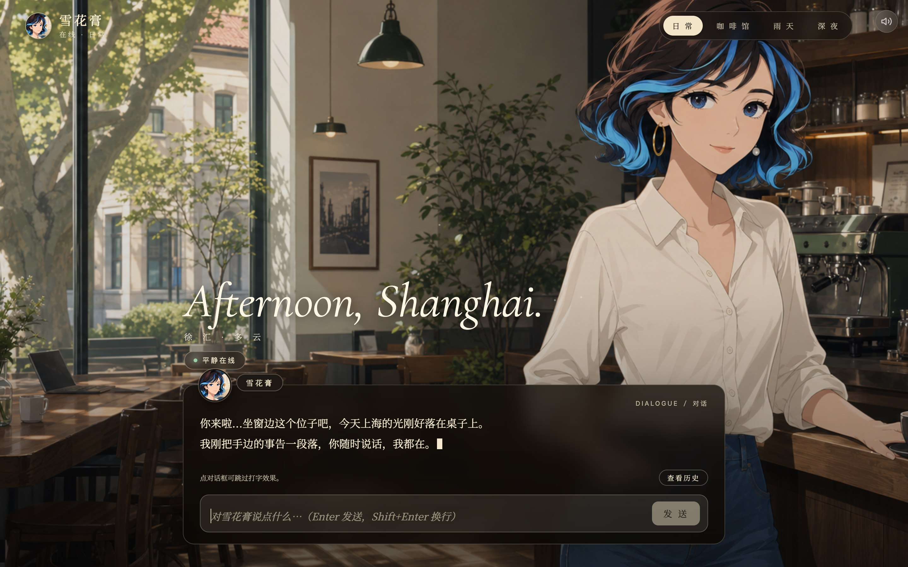
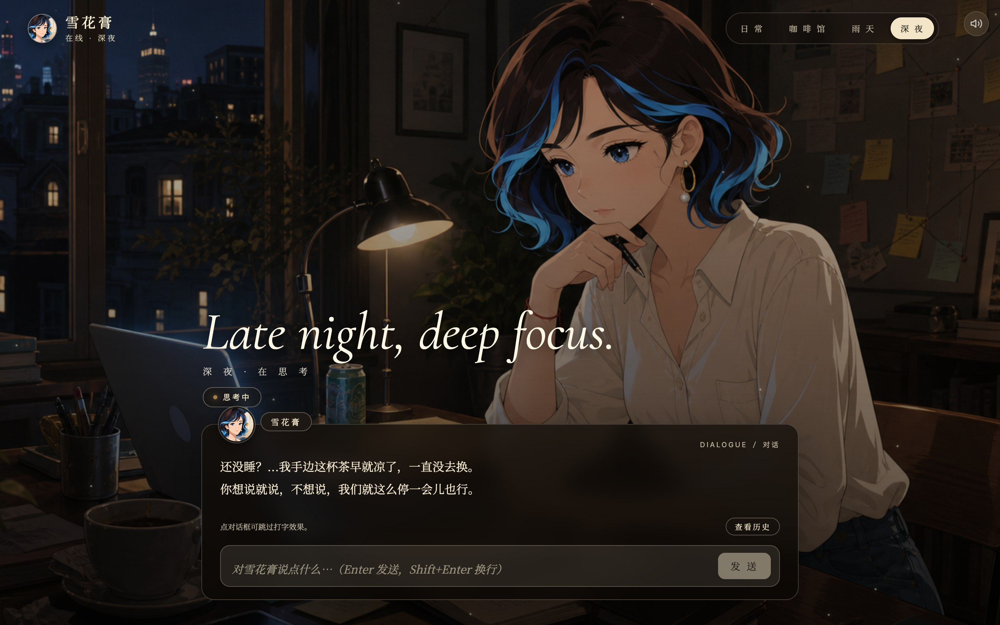
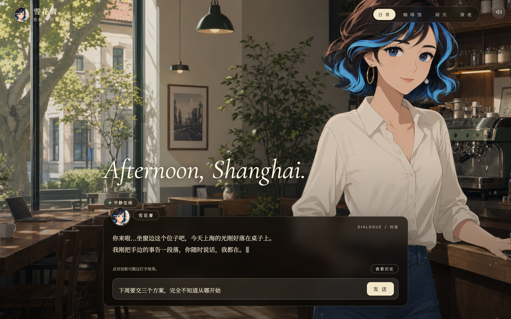
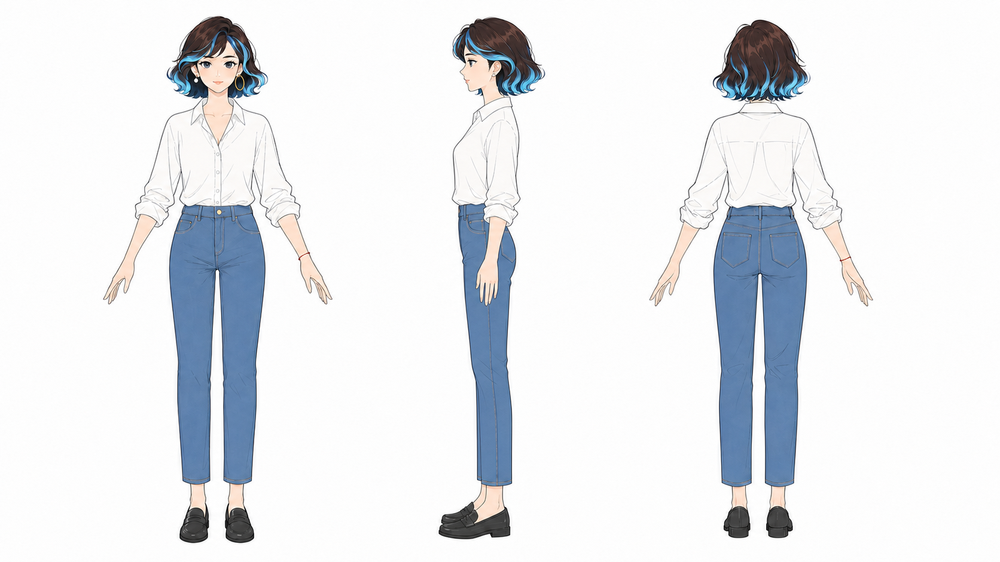
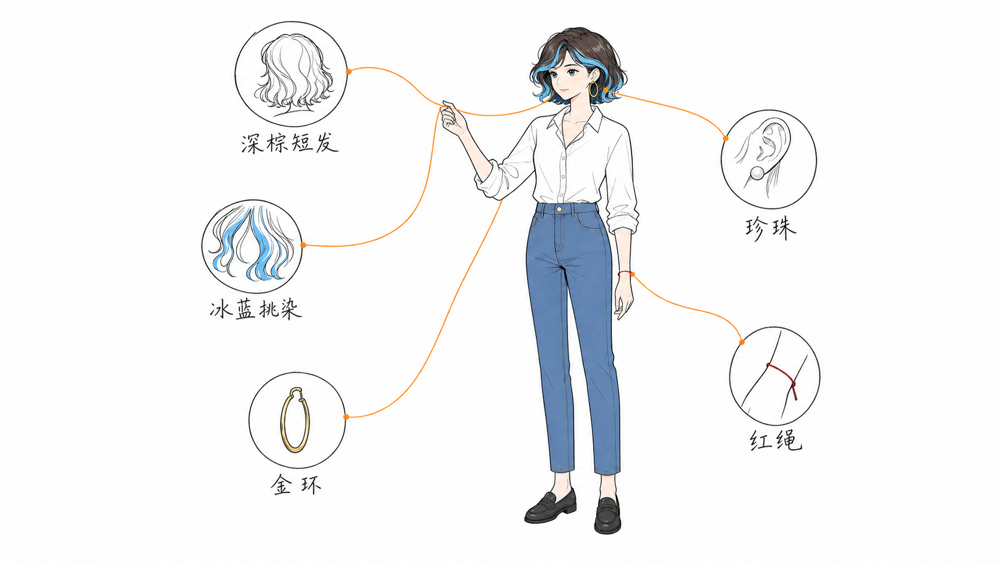
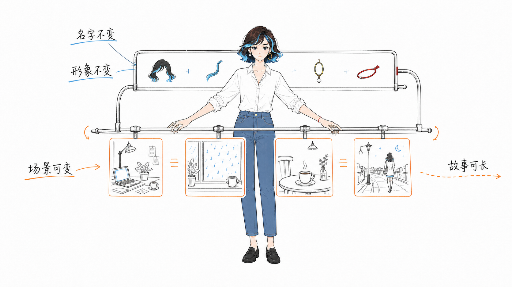
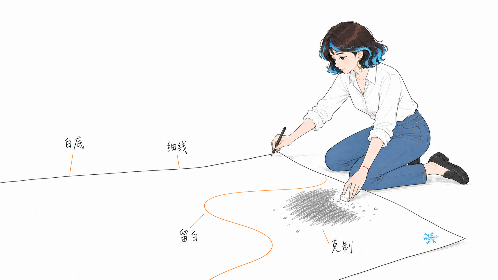
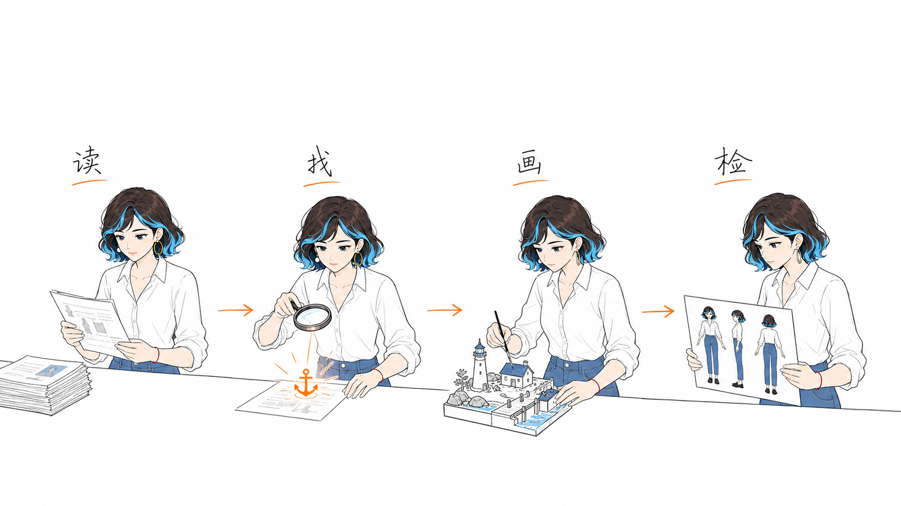
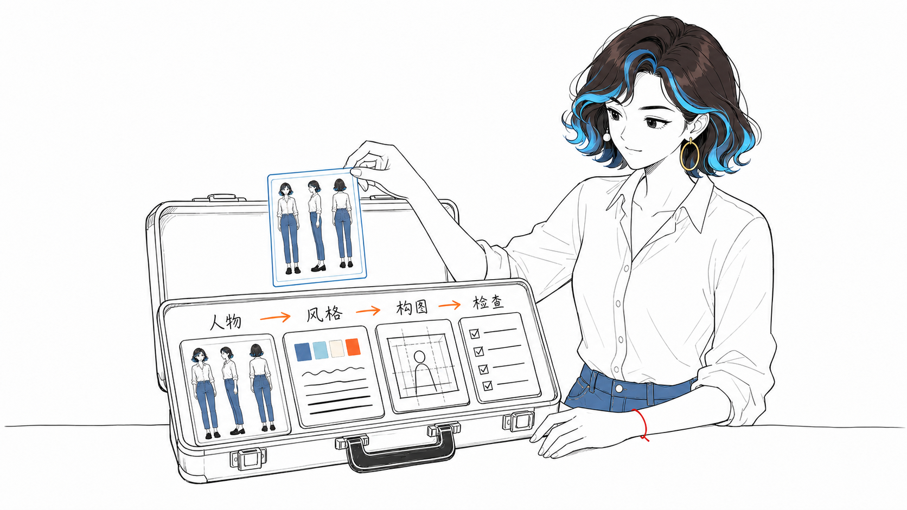
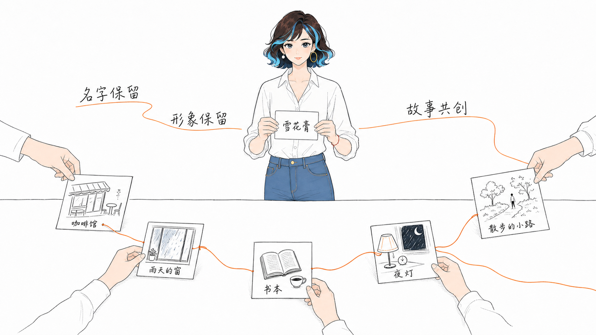

# 雪花膏 · XUEHUAGAO

> 拥有完整人格、视觉场景与声音沉浸的 AI 陪伴应用 —— 让对话从「回答问题」变成「有人坐在对面陪你」。

## 致谢

特别感谢复旦大学**计育韬**老师与 Alice 之父**洛小山**老师——两位优秀工程师的经验分享精神，是这个项目能够完成的重要养分。

## 名字从哪里来

雪花膏的名字，来自我第一次去上海买伴手礼。那盒经典上海雪花膏上的女生头像，是一个民国时期的上海女生形象；她的脸和我想象中的这个角色特别像。于是，我把她叫作雪花膏。

## 项目简介

雪花膏是一个场景化 AI 陪伴对话原型。它想验证的不是让聊天机器人多说几句温柔的话，而是让对话拥有可感知的空间、状态和节奏：用户不仅能看到她在哪里，也能感到她正在用哪一种方式回应。

普通聊天通常只有一块输入框。雪花膏把一次对话拆成三层：视觉上是可切换的场景与角色，语言上是与场景匹配的回复策略，听觉上是环境声和轻量交互反馈。三层一起工作，才让“她在这里”这件事成立。

### 协作方式

雪花膏不是由某一个工具独立生成的作品。角色的来源、人格方向、素材取舍与每轮验收由我决定；Kimi 先用于梳理如何获得更好调研结果的方法，再将人格相关调研整合为角色底稿；Codex 用于场景 Prompt 与音效方案设计，MuleRun 负责把明确需求执行为页面和服务端，K3 在最后一轮对体验进行优化。

<p align="center">
  
</p>
<p align="center"><sub>日常场景：角色、环境、状态文案与对话框共同构成完整的聊天空间。</sub></p>

### Demo 里有什么

| 层级 | 在页面上看到的内容 | 它承担的作用 |
| --- | --- | --- |
| 视觉场景 | 日常、咖啡馆、雨天、深夜四个场景 | 不只换背景，也标记雪花膏此刻所处的状态。 |
| 对话策略 | 每个场景有不同的语气、节奏、开场方式和帮助方式 | 日常偏执行与整理，咖啡馆用于灵感发散，雨天先承接情绪，深夜用于结构化分析。 |
| 人格编排 | Base Persona、Knowledge Base、Scene Prompt 与 Orchestration | 把“她是谁、知道什么、在不同情境如何说话”变成可调用的规则，而不只是一段泛泛 Prompt。 |
| 声音沉浸 | 开屏、场景切换、收发消息与四类环境声 | 为场景补上空气感，但不抢走对话本身。 |

<table>
  <tr>
    <td width="50%"></td>
    <td width="50%"></td>
  </tr>
  <tr>
    <td align="center"><sub>深夜：把问题慢慢拆开。</sub></td>
    <td align="center"><sub>输入状态：用户仍能看见角色此刻的情绪与空间。</sub></td>
  </tr>
</table>

### 它是怎么工作的

前端是一个 Galgame 风格的全屏对话页，用户可以主动切换场景。服务端则在每轮消息里处理场景识别、人格与知识检索、提示词组装、生成前检查、回复生成和上下文更新；路由会结合当前场景、用户情绪与对话意图，决定保持场景还是切换到更合适的回应方式。

所以，场景不是装饰按钮：同一句用户输入在不同场景中，会得到不同的语气与帮助策略。项目当前把这套能力做成可直接运行、可体验的网页，也保留了向图片理解与 OCR 扩展的接口空间。

### 查看完整展示页

仓库内的 [`public/showcase/index.html`](public/showcase/index.html) 是完整项目展示页。启动应用后访问 `/showcase/`，可以按“为什么做 → 怎么实现 → 体验预览”的顺序浏览这个项目。

## 🎨 IP 介绍 · 雪花膏是谁

雪花膏是这个项目的固定视觉主人公：不是吉祥物、贴纸或万能助手，而是一个安静、认真、有自己生活的人。26 岁，苏州人，独居上海徐汇永嘉路附近，做项目调度与协调——擅长把散落的事项对齐、推进和收尾。安静克制、观察细、略有过度准备，偶尔带一点冷幽默。

<p align="center">
  
</p>
<p align="center"><sub>雪花膏三视图 · 用于在任何画风下锁定比例与造型</sub></p>

**强制视觉锚点**（任何画风下都必须可识别）：

- 锁骨长度的深棕色微卷短发 + 冰蓝与少量白色挑染
- 左耳金色圆环、右耳珍珠耳钉——永远不对称
- 左手腕细红绳（奶奶给的）
- 蓝灰色眼睛，瞳孔含极细星尘，眼角有极淡「泪沟光」
- 基准服装：白色卷袖衬衫、高腰蓝色直筒牛仔裤、黑色乐福鞋

**画面气质**：表情平静认真、略带思考；动作自然有真实重量；画面可以荒诞，人物不能幼稚。

<details>
<summary><b>展开 9 张角色讲解图</b>（人设拆解 · 视觉语言 · 共创流程）</summary>

<table>
  <tr>
    <td width="50%"></td>
    <td width="50%"></td>
  </tr>
  <tr>
    <td width="50%"></td>
    <td width="50%"></td>
  </tr>
  <tr>
    <td width="50%"></td>
    <td width="50%"></td>
  </tr>
  <tr>
    <td width="50%"></td>
    <td width="50%"></td>
  </tr>
  <tr>
    <td colspan="2" align="center"></td>
  </tr>
</table>

</details>

> 完整的 IP 定义文档见 [`illustrations/xuehuagao-ip.md`](illustrations/xuehuagao-ip.md)；可复用的插画生成 Skill（风格 DNA、提示词模板、质检清单）在 [xuehuagao-illustrations 仓库](https://github.com/xiangzi-cyber/xuehuagao-illustrations)。

## 🌐 线上地址

| 内容 | 链接 |
|---|---|
| **项目展示页**（自有域名） | **https://xuehuagao.xiangzi.info** |
| 展示页备用地址（Cloudflare Pages） | https://xuehuagao-showcase.pages.dev |
| **应用界面**（自有域名，画卷开屏 + 四场景） | **https://app.xiangzi.info** |
| 应用备用地址（Cloudflare Pages） | https://xuehuagao-app.pages.dev |
| 雪花膏插画 Skill 仓库 | https://github.com/xiangzi-cyber/xuehuagao-illustrations |

展示站源码在 `public/showcase/` 目录（应用内访问 `/showcase/`），部署展示站：`npx wrangler pages deploy public/showcase --project-name=xuehuagao-showcase`

## 项目结构

```
xuehuagao-app/
├── server.js                  # Express 后端 · v2 人格编排管线（7 步 Pipeline）
├── illustrations/             # IP 视觉资产：三视图 + 9 张角色讲解图 + IP 定义文档
├── package.json
└── public/
    ├── index.html             # Galgame 风格单页前端（自包含，无构建步骤）
    ├── showcase/                # 项目展示页（访问 /showcase/）
    ├── audio-immersion.js     # 沉浸音频模块（Web Audio，场景交叉淡入淡出）
    ├── xuehuagao.png          # 大立绘 / 头像
    ├── scenes/                # 4 张全屏场景背景
    │   └── normal / thinking / rainy / cafe .png
    └── audio/                 # 8 个音频资产
        ├── opening_enter.mp3        # 开屏音
        ├── ui_message_send.wav      # 发送音效
        ├── ui_message_receive.wav   # 接收音效
        ├── scene_switch_soft.wav    # 场景转场音
        └── normal_room / cafe_ambient / rainy_window / thinking_night _loop.mp3
```

## 本地运行

```bash
cd xuehuagao-app
npm install
npm run dev          # 默认 3000 端口；PORT=8080 npm run dev 可指定
```

打开 http://localhost:3000

## 环境变量

| 变量 | 说明 | 默认 |
|---|---|---|
| `PORT` | 监听端口 | `3000` |
| `LLM_API_KEY` | 模型 API Key | 回退 `KIMI_API_KEY`，两者都无则启用角色化兜底回复 |
| `LLM_BASE_URL` | 模型接口地址 | 回退 `KIMI_BASE_URL` → `https://api.kimi.com/coding/v1` |
| `XUEHUAGAO_MODEL` | 模型名（兼容旧名 `LUMI_MODEL`） | `kimi-k2-turbo-preview` |

> 没有可用 Key 时应用不会崩溃：雪花膏会以角色化兜底语句回应（优雅降级 + 3 次重试）。

## API

- `POST /api/chat` — body `{ "message": "...", "history": [{role, content}] }` → `{ reply, scene }`
- `GET /api/health` → `{ ok, model, version }`

## v2.0 升级清单

**后端**：安全响应头 · 请求日志 · 输入校验 · LLM 失败优雅降级与重试 · 静态资源缓存策略（媒体 immutable / HTML no-cache）· 优雅关闭 · 密钥解析链
**前端**：移动端适配与安全区 · 消息时间戳 · 失败重试按钮 + 30s 超时 · 打字中动画 · textarea 自动增高 + 中文输入法合成保护 · 场景图预加载 · 全套 aria/键盘可访问性 · `prefers-reduced-motion` 降级 · 品牌区实时场景名
**音频**：首次手势自动解锁 + 解锁前请求补播 · 场景环境音 350/500ms 交叉淡入淡出（防叠音泄漏）· 分组音量 API（master/ambient/sfx）+ localStorage 持久化 · 加载失败静默降级重试

## 部署上线

这是一个普通 Node.js 应用，可部署到任何支持 Node ≥18 的平台：

**Railway / Render / Fly.io（推荐，免费档可用）**
1. 把 `xuehuagao-app/` 推到一个 Git 仓库
2. 在平台新建服务，Root Directory 指向该目录
3. Build：`npm install`，Start：`npm start`
4. 在平台环境变量里配置 `LLM_API_KEY` / `LLM_BASE_URL`

**自有 VPS**
```bash
npm install --omit=dev
PORT=80 LLM_API_KEY=sk-... nohup npm start &
# 建议前面再套一层 Caddy/Nginx 做 HTTPS
```

**mulerun（原部署方式）**：按 mulerun 文档上传本目录即可，入口 `server.js`。

> 注意：`xuehuagao.png` 与 `scenes/*.png` 单张约 2MB，如部署到按流量计费平台可自行压缩。
